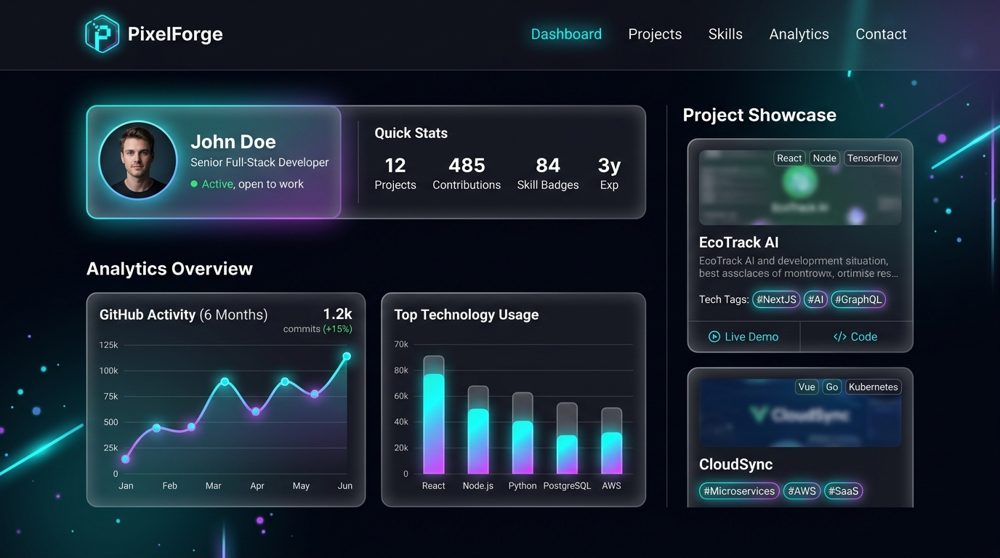

# 🚀 PixelForge - Enterprise Full-Stack Developer Portfolio & Showcase



[](https://portfolio-iota-six-26.vercel.app)
[](https://github.com/sunnykumar6207058974-source/portfolio)
[](https://nodejs.org)
[](https://react.dev)
[](https://mongodb.com)

---

## 📝 Project Description

**PixelForge** is an enterprise-grade full-stack developer portfolio and digital media showcase web application built for Sunny Kumar. Designed with modern web aesthetics, glassmorphism, fluid micro-animations, and full-stack API capabilities, PixelForge features:

- A client-side React single-page application with responsive layouts across Desktop, Tablet, and Mobile devices.
- A Node.js & Express.js RESTful API engine providing authentication, email dispatching, project showcase management, and analytics tracking.
- An automated MongoDB database integration supporting both external MongoDB clusters and zero-configuration **MongoMemoryServer** for seamless local development and automated CI/CD testing.

---

## 🌐 Live Demo & Repository

- **🌐 Live Production Web App**: [https://portfolio-iota-six-26.vercel.app](https://portfolio-iota-six-26.vercel.app)
- **💻 GitHub Source Code Repository**: [https://github.com/sunnykumar6207058974-source/portfolio](https://github.com/sunnykumar6207058974-source/portfolio)
- **⚡ Express API Health Check**: [http://localhost:5001/api/health](http://localhost:5001/api/health)
- **🔐 Admin Analytics Portal**: [http://localhost:5173/admin](http://localhost:5173/admin)

---

## ✨ Key Features

- **🎨 Modern Visual Aesthetics & Interactivity**:
  - HTML5 Canvas dynamic particle network animation hero background.
  - Video walkthrough modals with auto-play hover preview cards.
  - Dual Dark / Light theme toggle system with local state persistence.
  - Custom fluid mouse cursor & smooth scroll progress indicator.
  - Interactive printable Resume Viewer with instant PDF download.

- **📊 Executive Admin Analytics Dashboard**:
  - Live visitor traffic, project view counters, and engagement charts.
  - Complete CRUD management for Projects, Services, Skills, and Contact Messages.
  - Website settings control (Hero Headline, SEO Title, Social Links).

- **🔐 Authentication & Zero-Trust Security**:
  - JWT Access Token & Refresh Token authentication.
  - Password hashing with `bcryptjs` (`genSalt(10)`).
  - Protected API routes & Admin role authorization middleware.
  - NoSQL injection protection (`express-mongo-sanitize`), XSS sanitization (`xss-clean`), and HTTP security headers (`helmet`).

- **📩 Instant Contact & Notification Dispatch**:
  - Validated contact form submission with instant success notifications.
  - Automated Nodemailer SMTP email alerts to admin inbox.

---

## 🖼️ Application Screenshots & Previews

| Feature / Screen | Preview Screenshot |
| :--- | :--- |
| **PixelForge Showcase Dashboard** |  |
| **Featured Projects & Video Popup** | [`Cartify`, `UrbanThread`, `PixelForge`, `Aetheria`] |
| **Interactive Resume Viewer** | Includes B.Tech CS credentials, project experience & printable layout |
| **Admin Portal & JWT Login** | Includes pre-filled demo credentials for instant dashboard review |

---

## 🛠️ Technology Stack

### Frontend Client
- **Framework**: React.js (v19) + Vite (v8)
- **Styling**: Vanilla CSS, HSL Color Systems, Glassmorphism, Tailwind CSS (v4)
- **Animations**: Framer Motion (v12)
- **Icons & Visuals**: React Icons, Swiper, HTML5 Canvas 2D Context

### Backend Server & Database
- **Runtime & Server**: Node.js + Express.js (v4)
- **Database ORM**: MongoDB + Mongoose (v8)
- **In-Memory Database**: MongoMemoryServer (Zero-config embedded MongoDB server)
- **Authentication**: JSON Web Token (`jsonwebtoken` + `bcryptjs`)
- **Security**: Helmet, Express Rate Limit, Express Mongo Sanitize, XSS-Clean
- **Validation**: Express Validator
- **Media & Email**: Cloudinary SDK, Multer, Nodemailer

---

## ⚡ Installation Steps & Running Locally

### 1. Clone the Repository
```bash
git clone https://github.com/sunny/pixelforge.git
cd pixelforge
```

### 2. Install Dependencies
```bash
# Install dependencies across Root Monorepo, Frontend, and Backend:
npm run install:all
```

### 3. Environment Setup
Create a `.env` file in the `backend/` directory:
```env
PORT=5001
MONGO_URI=mongodb://127.0.0.1:27017/pixelforge
JWT_SECRET=pixelforge_super_secret_jwt_key_2026
JWT_REFRESH_SECRET=pixelforge_refresh_secret_2026
CLIENT_URL=http://localhost:5173,http://localhost:5174,http://localhost:5175,http://localhost:5176
```

### 4. Start Development Servers
```bash
# Run both Frontend (Vite) and Backend (Express) concurrently:
npm run dev
```
- **Frontend App**: [http://localhost:5173](http://localhost:5173)
- **Backend API**: [http://localhost:5001/api/health](http://localhost:5001/api/health)

### 5. Run Automated E2E Test Suite
```bash
# Run complete 14/14 automated API, Database, and Auth integration tests:
node backend/test_e2e.js
```

### 6. Production Build
```bash
# Compile frontend for production deployment:
npm run build
```

---

## 📡 API Endpoint Reference

| Method | Endpoint | Access | Description |
| :--- | :--- | :--- | :--- |
| `GET` | `/api/health` | Public | Backend system health check & uptime info |
| `GET` | `/api/projects` | Public | Fetch all featured projects (with category filter) |
| `GET` | `/api/projects/:id` | Public | Fetch single project details by ID |
| `POST` | `/api/projects` | **Protected (Admin)** | Create new project in MongoDB database |
| `PUT` | `/api/projects/:id` | **Protected (Admin)** | Update project by ID |
| `DELETE` | `/api/projects/:id` | **Protected (Admin)** | Delete project by ID |
| `GET` | `/api/services` | Public | Fetch service offerings list |
| `POST` | `/api/services` | **Protected (Admin)** | Create new service offering |
| `GET` | `/api/skills` | Public | Fetch skill badges and progress statistics |
| `POST` | `/api/skills` | **Protected (Admin)** | Create new skill badge |
| `POST` | `/api/contact` | Public | Submit contact message (with input validation) |
| `GET` | `/api/contact` | **Protected (Admin)** | Fetch received contact messages list |
| `DELETE` | `/api/contact/:id` | **Protected (Admin)** | Delete contact message by ID |
| `POST` | `/api/auth/register` | Public | Signup new Admin user account |
| `POST` | `/api/auth/login` | Public | Login Admin user & issue JWT Access/Refresh tokens |
| `GET` | `/api/auth/profile` | **Protected** | Fetch authenticated user profile details |
| `GET` | `/api/admin/dashboard`| Public | Fetch analytics counters, device stats & traffic data |
| `GET` | `/api/config` | Public | Fetch site configuration & SEO metadata |
| `PUT` | `/api/config` | **Protected (Admin)** | Update website info, hero text & social links |

---

## 🔑 Demo Admin Credentials

For instant dashboard review, use the pre-filled credentials:
- **Admin Email**: `sunnykumar6207058974@gmail.com`
- **Admin Password**: `sunnypassword123` or `sunny123456`

---

## 📜 License & Copyright

Designed and developed by **Sunny Kumar** © 2026. All rights reserved.
